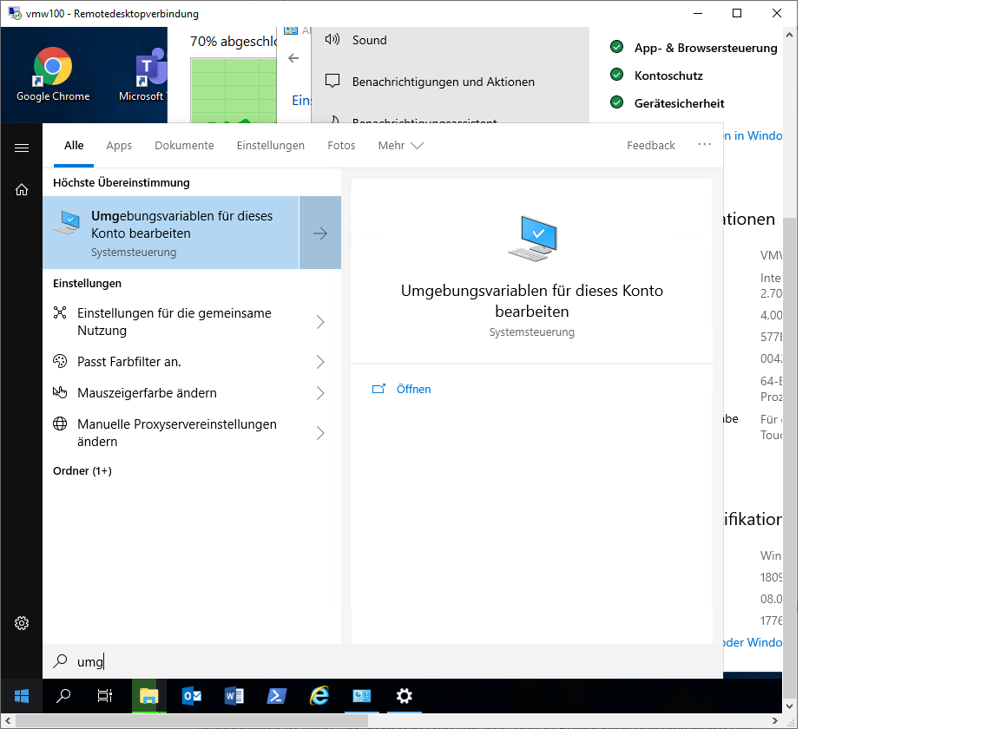
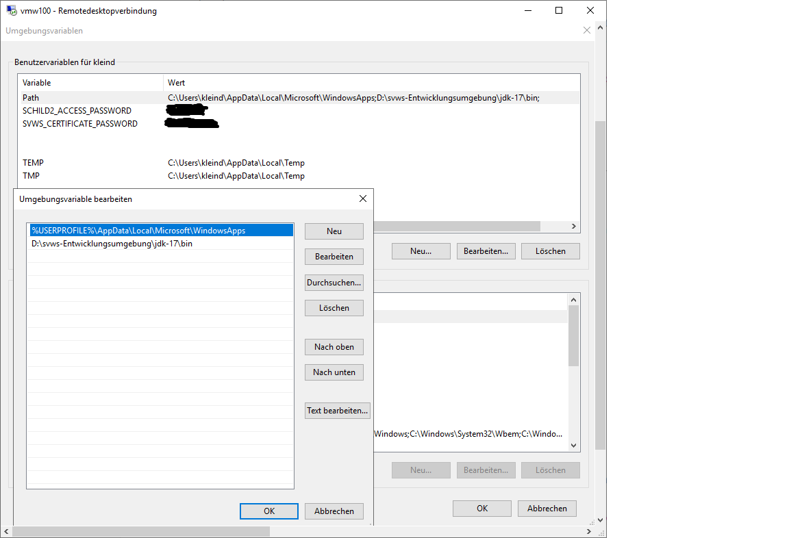
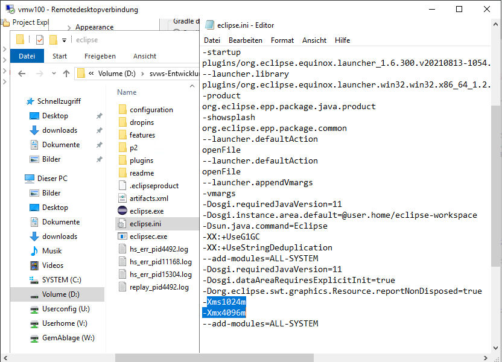

***Installation unter Windows 10 64bit***
====================


# Systemvoraussetzungen und Installationshinweise
Die gesammte Entwicklungsumgebung belegt in etwa 3 GB und sollte auf einem lokalem Laufwerk liegen.

# Maria db installieren

+ download : Maria db 10.6 -> https://mariadb.org/download/?t=mariadb&p=mariadb&r=10.6.5&os=windows&cpu=x86_64&pkg=msi&m=netcologne
+ root user einrichten

# JDK 17 installieren

+ Download des jdk-17 -> https://download.oracle.com/java/17/latest/jdk-17_windows-x64_bin.zip
+ Entpacken in z.B. D:\svws_Entwicklungsumgebung\jdk-17\
+ Path setzen: 
    + Über das Windowssymbol den Editor für die Umgebungsvariablen öffnen 
    + die Variable Path bearbeiten und einen weiteren Eintrag zum Java Verzeichnis einfügen







# Eclipse installieren und konfigurieren

+ Installieren eclipse-inst-win64.zip (aktuelle Version) (Eclipse IDE for Java Developers)-> https://www.eclipse.org/downloads/
+ Einmaliger Start Eclipse und festlegen des Workspace: `D:\\svws_Entwicklungsumgebung\workspace\`
+ Bei Bedarf den Speicher hochsetzen: per texteditor `D:\svws_Entwicklungsumgebung\workspace\eclipse.ini` entsprechend z.B. aus der 512 eine 2048 machen



+ Eclipse > Help > Marcet Place -> JSON editor suchen und "JSON Editor Plugin 1.1.2" installieren


+ Eclipse > Window > Preferences > General > Editors > Text Editors > Spelling > UTF-8


+ Eclipse > Window > Preferences > General > Workspace > Text file encodig > Other UTF-8


## Git Repositories in Eclipse einrichten 

+ Eclipse > Windows > Perspektive > Open Perspective > Other  -> Git

### Quellen aus GitLab / Github eintragen:

+ Repositories in Eclipse clonen: rechte Maustaste Git > Clone a Git Repository
+ URL und Passwort eingeben

Bei Gitlab benötigt man als "Passwort" in Eclipse den persönlichen Github Token.

+ https://git.svws-nrw.de/SVWS-Server (Mono-Repository mit Core, DB, Client und UI-Components und Apps)

Alternativ benutzen Sie die GitHub Quellen.  

Anschließend git clone ausführen.

## Gradle Projekte laden

Nun müssen nur noch in der "gradle perspektive" die im git Verzeichnis liegenden gradle Projekte importiert werden. 

#### SVWS Einstellungen

Die Beispiel-Config ins Zielverzeichnis kopieren und umbenennen.

```
 git/SVWS-Swerver/svws-server-app/src/main/resources/svwsconfig.json.example #Zielverzeichnis#/svwsconfig.json
```
		
Beispiel einer svwsconfig.json, bitte die Userdaten und Passwörter entspechend anpassen:
		
```json
{
"EnableClientProtection" : null,
"DisableDBRootAccess": false,
"DisableAutoUpdates" : false,
"UseHTTPDefaultv11": false,
"PortHTTPS": 443,
"UseCORSHeader": true,
"ClientPath": ".../git/SVWS-Server/svws-webclient/build/output",
"LoggingEnabled": true,
"LoggingPath": "logs",
"TempPath": "/home/svwsdeveloper/temp",
"TLSKeystorePath": ".",
"TLSKeystorePassword": "svwskeystore",
"DBKonfiguration": {
	"dbms": "MARIA_DB",
	"location": "localhost",
	"SchemaKonfiguration": [
		{
		"name": "schildtest",
		"svwslogin": false,
		"username": "svwsadmin",
		"password": "svwsadmin"
		}
		]
	}
}
```

# Optionale Software 


## DBeaver
+ download: https://dbeaver.io/download/

## VSCodeUserSetup
+ Install VSCodeUserSetup-x64-latest.exe (optional)

## git per terminal auf Windows 

+ Ohne Administrationsrechte installierbar
+ hier die Anleitung auf heise.de -> https://www.heise.de/tipps-tricks/Git-auf-Windows-installieren-und-einrichten-5046134.html
+ download:  https://git-scm.com/download/win
+ Ggf. noch den Proxy eintragen: git config --global http.proxy http://10.1.2.3:3128

# Installation in einer Proxy-Umgebung


```
Eclipse > Windows > Preferences > General > Network Connection
````

den Http und den Https-Proxy eintragen. (Sollte er automatisch finden, wenn konfiguriert.)

Powershell öffnen im Ordner SVWS-Server
Proxy Config für NodeJS

```shell
		npm config set proxy http://proxy.company.com:8080
		npm config set https-proxy http://proxy.company.com:8080
```
