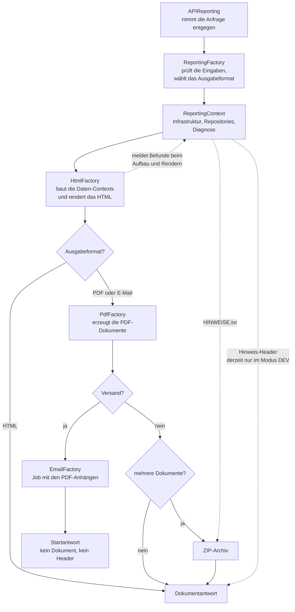
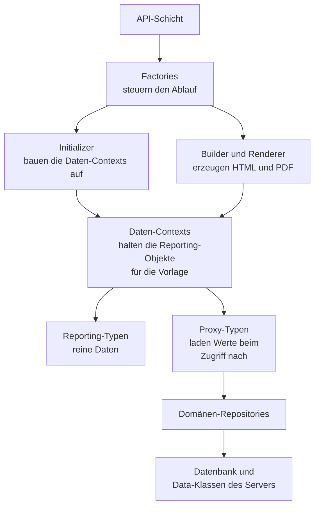
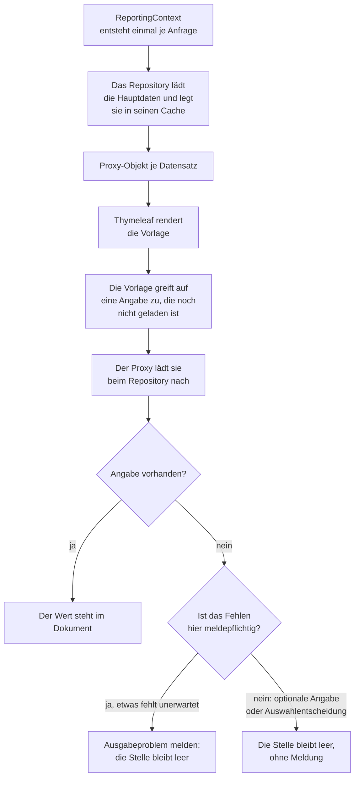
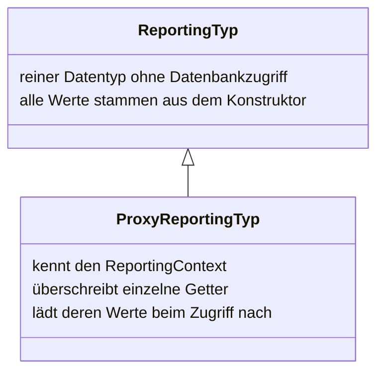
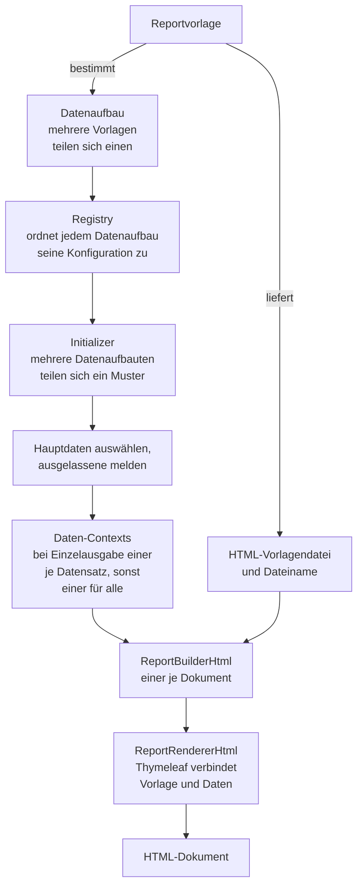
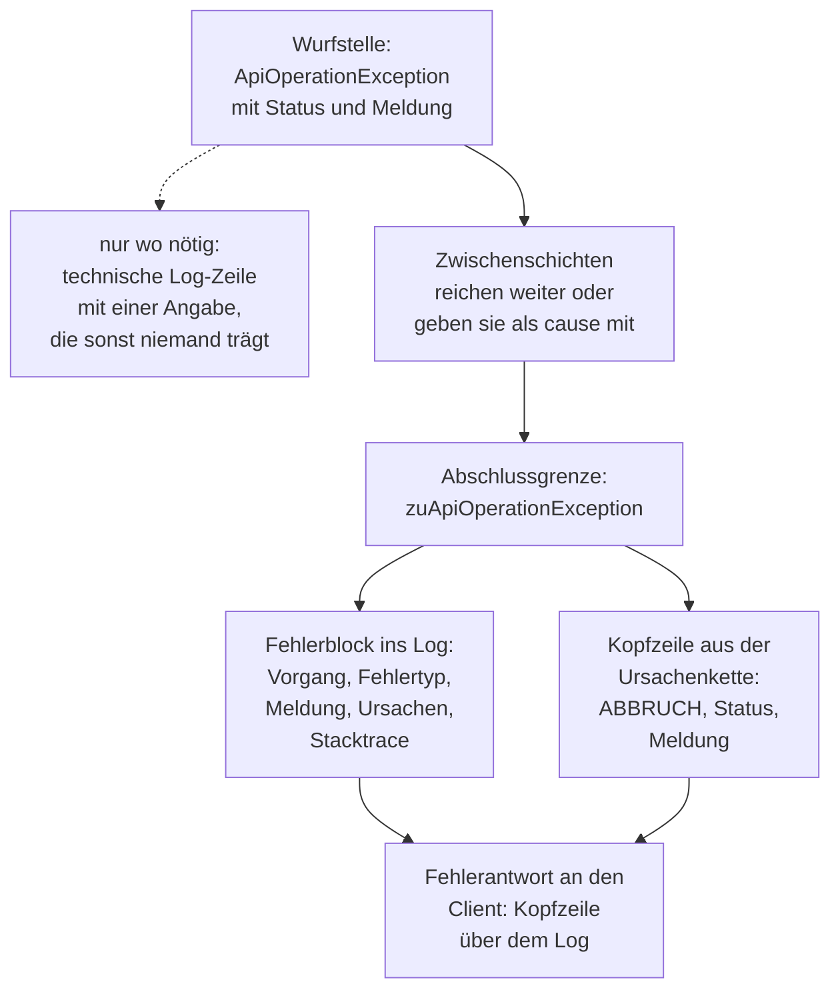
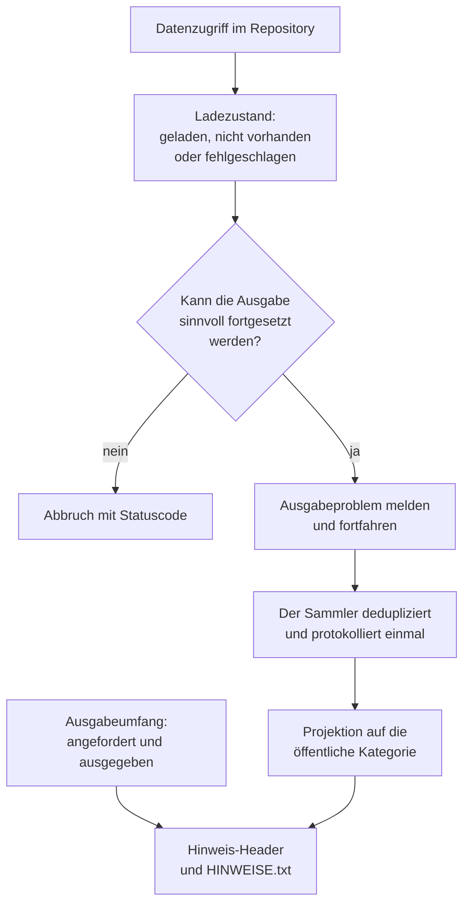
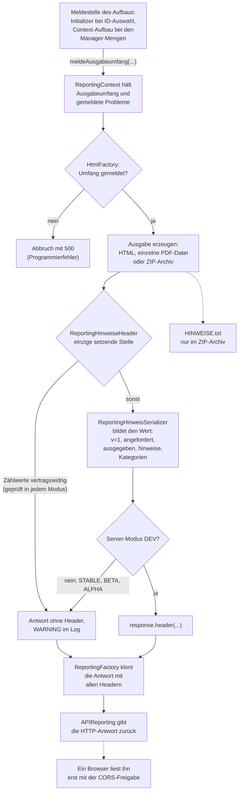

# Struktur des Reporting-Moduls

Diese Dokumentation beschreibt den Ablauf der Report-Erzeugung im SVWS-Server und die Verantwortung der einzelnen Klassen-Typen. Sie richtet sich an Entwickler, die das Reporting-Modul erweitern oder warten.

Die Doku des Reporting-Moduls ist auf mehrere Dateien verteilt:

- **[`README.md`](README.md)** — der Einstieg: Wegweiser, ein Fünf-Minuten-Überblick am Beispiel und die Begriffstabelle zu den vier Bedeutungen von „Context".
- **`reporting-architektur.md`** (diese Datei) — *beschreibt* Schichten, Klassen und Datenfluss.
- **[`reporting-konventionen.md`](reporting-konventionen.md)** — die *verbindlichen* Regeln und Invarianten (Schichtentrennung, Null-Sicherheit, Fehlercodes, OGNL-Grenzen). **Vor jeder Änderung am Modul lesen**; bei Konflikt gilt die Konventionen-Datei.
- **[`reporting-template-erstellung.md`](reporting-template-erstellung.md)** — Schritt-für-Schritt-Anleitung für Vorlagen-Autoren.
- **[`reporting-sortierung-und-filterung.md`](reporting-sortierung-und-filterung.md)** — Anleitung, wie eine Sortierung oder ein Filter für einen Reporting-Typ ergänzt wird.

---

## 1. Einleitung

Das Reporting-Modul (`svws-module-reporting`) erzeugt aus Datenbankinhalten formatierte Reports — typischerweise auf Basis von HTML-Vorlagen, die über Thymeleaf gerendert werden. Aus dem gerenderten HTML lassen sich anschließend PDF-Dateien erzeugen oder per E-Mail versenden.

Architekturisch arbeitet das Modul in vier Schichten:

1. **API-Schicht** (`svws-openapi`) nimmt den Request entgegen.
2. **Factory-Schicht** orchestriert den Ablauf, validiert Eingaben und übergibt an Format-Factories.
3. **Daten-Schicht** (`ReportingContext` + Domänen-Repositories) lädt und cached die fachlichen Daten aus der Datenbank.
4. **Render-Schicht** (Builder + Renderer + Format-Factories) erzeugt die finale Ausgabe (HTML, PDF, ZIP) bzw. reicht sie an den E-Mail-Versand weiter.

---

## 2. Schichten im Überblick

Die Pipeline einer Report-Erzeugung ist immer dieselbe. Was sich je Anfrage unterscheidet, ist das
Ausgabeformat und der Datenaufbau.

Die durchgezogenen Pfeile bedeuten hier **„danach"**, nicht „ruft auf" — wer wen kennen darf, steht
in Abschnitt 2.1 und sieht anders aus.

Die Diagnose ist kein eigener Schritt, sondern läuft mit: Sie sammelt Befunde während des
Daten- und Context-Aufbaus und während des Renderns und speist zwei ungleiche Kanäle — den Header an einer Dokumentantwort und die Beilage
allein im Archiv (Abschnitt 9.3). Die Startantwort des E-Mail-Versands trägt nichts von beidem.
Der Header wird derzeit nur im Server-Modus `DEV` gesetzt; die Regeln dazu stehen in den
Konventionen, der Weg dorthin in Abschnitt 9.3.

### 2.1 Zulässige Abhängigkeiten

Das Bild oben zeigt, was nacheinander passiert. Wer wen kennen darf, ist eine andere Frage:

Ein Pfeil bedeutet „kennt und verwendet". Diese Regeln halten die Schichten auseinander:

- **Nur Repositories greifen auf Datenbank und Data-Klassen zu.** Alles darüber arbeitet mit
  Reporting-Typen.
- **Reine Reporting-Typen kennen weder ein Repository noch den `ReportingContext`.** Allein die
  Proxys laden nach; sie sind Untertypen der reinen Typen (Abschnitt 5.3), weshalb eine Vorlage den
  Unterschied nicht sieht.
- **Die Builder kennen den `ReportingContext` nicht.** Sie erhalten Vorlage, Renderer und die
  fertig aufgebauten Daten-Contexts — mehr brauchen sie nicht. Nur so lässt sich ein Builder ohne
  Datenbankverbindung testen.
- **Der `ReportingContext` kennt niemanden über sich.** Factories, Initializer, Daten-Contexts,
  Repositories und Proxys verwenden ihn; er selbst hält nur die Repositories und die Infrastruktur
  dieser einen Anfrage.

---

## 3. Aufrufkette von der API

### 3.1 `APIReporting`

Pfad: `svws-openapi/.../api/server/APIReporting.java`

Die API-Klasse stellt die JAX-RS-Endpunkte des Reportings bereit:

- **HTML-Ausgabe**: `POST /db/{schema}/reporting/html` — gibt den Report als selbsttragendes HTML-Dokument zurück.
- **PDF-Ausgabe**: `POST /db/{schema}/reporting/ausgabe` — gibt den Report als PDF-Datei bzw. ZIP-Archiv zurück.
- **E-Mail-Versand**: `POST /db/{schema}/reporting/email` — startet den Versand als asynchronen Job.

Alle Endpunkte instanziieren die `ReportingFactory` und delegieren ihr die eigentliche Arbeit. Die API-Klasse selbst enthält keine Reporting-Logik — sie ist nur der Eintrittspunkt und stellt die Datenbankverbindung sowie die Berechtigungen bereit.

### 3.2 `ReportingFactory`

Pfad: `module.reporting.factories.ReportingFactory`

Die zentrale Eingangs-Factory. Im Konstruktor:

1. Validiert sie alle übergebenen Parameter (Datenbankverbindung, `ReportingParameter`, `ReportingAusgabeformat`, `ReportingReportvorlage`, IDs der Haupt- und Detaildaten).
2. Prüft, ob die Reportvorlage zum gewählten Ausgabeformat passt.
3. Erzeugt den zentralen `ReportingContext` (siehe Abschnitt 4) — alle weiteren Stufen arbeiten ausschließlich gegen dieses Kontext-Objekt.

Ihre Methode `createReportResponse()` dispatcht auf das Ausgabeformat:

| Ausgabeformat | Ablauf |
|---------------|--------|
| `HTML`        | `HtmlFactory.createHtmlResponse()` |
| `PDF`         | `HtmlFactory.createHtmlBuilders()` → `PdfFactory.createPdfResponse()` |
| `EMAIL`       | `HtmlFactory.createHtmlBuilders()` → `PdfFactory` → `EmailFactory.sendEmails(pdfFactory)` |

---

## 4. Datenebene

Die Repositories laden die Hauptdaten einmal je Anfrage. Alles Weitere holt der Proxy erst dann,
wenn die Vorlage danach fragt:

Das Nachladen passiert **während** des Renderns — deshalb entstehen Befunde noch dort und nicht
schon beim Aufbau der Daten. Nicht jedes Fehlen ist ein Befund: Eine optionale Angabe darf fehlen,
und ein vom Benutzerfilter ausgeschlossener Datensatz ist eine Auswahlentscheidung (Abschnitt 9.2).

### 4.1 `ReportingContext`

Pfad: `module.reporting.repositories.ReportingContext`

Der `ReportingContext` ist der zentrale Kontext-Container, der durch die gesamte Reporting-Pipeline gereicht wird. Er hält:

**Infrastruktur**
- `conn()` — `DBEntityManager` für DB-Zugriffe
- `reportingParameter()` — typisierte Parameter (siehe 4.4)
- `logger()` / `log()` — Logging-Infrastruktur (siehe Abschnitt 9)
- `sortierungService()` / `filterService()` — Querschnitts-Services für Sortierung und Filterung

**Zugriff auf Domänen-Repositories** (siehe 4.2)
- `repositorySchule()`, `repositoryKataloge()`, `repositoryLehrer()`, `repositorySchueler()`, `repositoryLerngruppen()`, `repositoryStundenplan()`, `repositoryGost()`, `repositoryGostKlausurplanung()`, `repositoryGostKursplanung()`

**Aktuell angemeldeter Benutzer**
- `benutzer()` liefert einen `ProxyReportingBenutzer`, der den angemeldeten Benutzer der DB-Verbindung bündelt (Benutzerdaten, E-Mail-Daten, benutzerbezogener `EmailJobManager`). Der Proxy wird im Konstruktor des Contexts initialisiert und steht damit allen nachgelagerten Schichten zur Verfügung — z. B. für E-Mail-Versand im Namen des Benutzers und für Berechtigungs-/Identitäts-Anzeigen in Reports.

Der `ReportingContext` selbst hält keine fachlichen Daten und keinen eigenen Cache — er delegiert vollständig an die Domänen-Repositories. Sein Konstruktor instanziiert in fester Reihenfolge die Domänen-Repositories und reicht jedem davon `this` weiter, sodass jedes Sub-Repository im Bedarfsfall auf die Infrastruktur und auf die anderen Domänen zugreifen kann.

### 4.2 Die Domänen-Repositories

Alle Repositories liegen unter `module.reporting.repositories`. Jedes ist verantwortlich für eine fachliche Domäne.

**Geladen wird beim ersten Zugriff.** Die Konstruktoren halten lediglich die Referenz auf den `ReportingContext`. Alle DB-Zugriffe erfolgen erst beim ersten Aufruf des jeweiligen Getters bzw. der ID-basierten Lookup-Methode und werden anschließend intern gecached.

**Zwei Repositories laden eigene Metadaten im Konstruktor.** `ReportingRepositorySchule` und `ReportingRepositoryStundenplan` holen dort kleine, ohnehin in jedem Report benötigte Daten: Schulstammdaten, Abschnitt und Stundenplandefinitionen.

**Die beiden GOSt-Planungs-Repositories arbeiten mit einem Manager.** `ReportingRepositoryGostKlausurplanung` und `ReportingRepositoryGostKursplanung` verwalten je einen Manager pro Reporting-Request, der über eine explizite `initManager(...)`-Methode initialisiert wird. Der Aufruf erfolgt aus dem Konstruktor des jeweils zuständigen HtmlContext — `HtmlContextGostKlausurplanungKlausurplan` bzw. `HtmlContextGostKursplanungBlockungsergebnis`. Die daraus abgeleiteten Reporting-Objekte (Klausurtermine, Kursklausuren und Schülerklausuren bzw. Blockungsergebnis, Schienen und Kurse) werden anschließend zentral im Repository aufgebaut und gecached.

**Daraus folgt eine Reihenfolge-Abhängigkeit.** Ein Zugriff auf diese beiden Repositories vor der Context-Erzeugung — etwa aus der `EmailFactory` — setzt voraus, dass der Manager bereits initialisiert ist.

| Repository | Verantwortung |
|------------|---------------|
| `ReportingRepositorySchule`              | Schulstammdaten, Schullogo, aktiver, kontextueller und ausgewählter Schuljahresabschnitt, Berechnungsmethoden auf Abschnittsebene |
| `ReportingRepositoryKataloge`            | Fächerkatalog, Jahrgänge, Erzieherarten, weitere stammdaten-nahe Listen |
| `ReportingRepositoryLehrer`              | Lehrkräfte, Kollegium, Leitungsfunktionen, Lehrer-spezifische Unterrichts-Aufstellungen |
| `ReportingRepositorySchueler`            | Schüler-Stammdaten, Lernabschnitte, Erzieher, Leistungsdaten, Sprachenfolgen |
| `ReportingRepositoryLerngruppen`         | Klassen und Kurse |
| `ReportingRepositoryStundenplan`         | Stundenpläne inkl. Pausen, Räume und Aufsichten |
| `ReportingRepositoryGost`                | Allgemeine Daten der gymnasialen Oberstufe: Abiturjahrgänge, Jahrgangsdaten und FächerManager, Laufbahn-Beratungsdaten, Abiturdaten, Fachwahlstatistik |
| `ReportingRepositoryGostKlausurplanung`  | GOSt-Klausurplanung: Klausurplan-Manager und die daraus abgeleiteten Objekte |
| `ReportingRepositoryGostKursplanung`     | GOSt-Kursplanung: Blockungsergebnis-Manager und die daraus abgeleiteten Objekte |

Schüler, Lehrkräfte und Kurse beziehen die beiden Planungs-Repositories über die zentralen
Repositories, damit deren Filterung und Sortierung auch dort gilt.

Die Repositories sind die einzigen Stellen im Modul, die `new DataXxx(...)` aus dem Server-DB-Paket aufrufen oder direkt Queries gegen `conn()` absetzen. Alle übrigen Schichten — insbesondere die Proxy-Reporting-Typen — gehen ausschließlich über die Repository-Methoden.

Auch das Instanziieren der zugehörigen `ProxyReporting…`-Objekte (z. B. `ProxyReportingSchueler`, `ProxyReportingLehrer`, `ProxyReportingKlasse`, `ProxyReportingKurs`) ist ausschließlich dem jeweiligen Repository vorbehalten. Damit existiert jedes Reporting-Objekt pro Reporting-Lauf nur einmal im Cache und `==`-Identität für gleiche IDs ist garantiert.

**Konvention zur Filter-Anwendung:** Listen- und Single-Object-Getter wenden den vom Anwender gesetzten `Reporting<Typ>.FILTER` zentral im Repository an (analog zur Sortierung). Listen-Getter liefern eine bereits gefilterte Liste; Single-Object-Getter (`schueler(id)`, `lehrer(id)`, `klasse(id)`, `kurs(id)`) geben `null` zurück, wenn das Objekt durch den User-Filter ausgeschlossen wurde. Damit verschwindet ein gefiltertes Objekt automatisch auch aus allen Backrefs (`schueler.klasse`, `klasse.klassenlehrer`, …). Aufrufer müssen entsprechend null-safe sein; Thymeleaf rendert `null` als leer. Cache-Befüllung und repo-interne Auflösung laufen unverändert ohne Filter — gefilterte Objekte bleiben im Cache, nur die öffentliche API-Rückgabe ist gefiltert.

### 4.3 Querschnitts-Services und Begleit-Dateien: Sortierung und Filterung

Sortierung und Filterung sind im Reporting-Modul typsicher pro Reporting-Typ konfiguriert. Für jeden Reporting-Typ existiert eine **Begleit-Datei** neben dem Typ, die dessen Registry (Whitelist erlaubter Attribute) und — bei Sortierung — die Standardsortierung beschreibt. Der zugehörige Reporting-Typ exponiert die fertigen Konfigurationen als statische Konstanten `SORTIERUNG` und `FILTER` mit den Typen `ReportingSortierung<T>` bzw. `ReportingFilterung<T>`.

Auf API-Seite übergibt der Endnutzer in den `ReportingParameter` für jeden Reporting-Typ eine eigene **Gruppe** (Schlüssel ist der einfache Klassenname, z. B. `"ReportingSchueler"`). Zustandslose Helfer-Services im `ReportingContext` — `ReportingSortierungService` und `ReportingFilterService` — extrahieren aus den Parametern die Gruppe zum gewünschten Typ. Die typisierte Umsetzung in einen `Comparator<T>` bzw. `Predicate<T>` erfolgt anschließend über die `SORTIERUNG`/`FILTER`-Konstante des Reporting-Typs.

Neue Reporting-Typen werden eingebunden, indem eine `Reporting<Typ>Sortierung`- und/oder `Reporting<Typ>Filter`-Begleit-Datei angelegt und am Reporting-Typ eine `SORTIERUNG`/`FILTER`-Konstante exponiert wird — ohne Eingriff in die Services.

Die Bausteine im Einzelnen — Registry, Companion-Dateien, Services, Factories — und die
Schritt-für-Schritt-Einbindung eines neuen Typs beschreibt die Anleitung
[`reporting-sortierung-und-filterung.md`](reporting-sortierung-und-filterung.md).

### 4.4 Parameter

- **`ReportingParameter`** (Paket `core.data.reporting`) — POJO aus dem Core-Modul mit den über die API übergebenen Steuerungsdaten (Reportvorlage, Ausgabeformat, IDs, Sortierungs- und Filterangaben).
- **`ReportingParameterTypisiert`** (Paket `module.reporting.parameter`) — typisierter Wrapper, der die untypisierten Felder (z. B. enum-Werte als String) in stark typisierte Werte umsetzt und Komfort-Getter wie `idHauptdatenObjekt()`, `idsHauptdaten()`, `idsDetaildaten()`, `reportVorlage()`, `einzelausgabeDaten()` bereitstellt.

### 4.5 Validierung der Eingabeparameter

Die Eingabe-Validierung liegt in der paketprivaten Hilfsklasse `HtmlContextValidierung` (Paket `html.contexts.initializer`) und wird von den Initializern vor dem Bau der `HtmlContext`-Instanzen aufgerufen. Ihre Methoden sind statisch. Alle Prüfungen, die Daten nachladen, nehmen den `ReportingContext` als ersten Parameter — nur so sind sie sowohl aus den Initializern als auch als Methodenreferenz aus der request-unabhängigen Konfiguration der Registry heraus verwendbar. Die reinen Wertprüfungen `validiereAbiturjahrgang(...)` und `validiereHalbjahr(...)` kommen ohne ihn aus und sind dadurch ohne Infrastruktur testbar. Neben den allgemeinen Prüfungen enthält sie die je Datenaufbau gebündelten Zusatzprüfungen (`pruefungenGostAbitur(...)`, `pruefungenGostLaufbahnplanung(...)`), die in der Registry als Methodenreferenz eingetragen sind:

- `pruefeUndMeldeAuswahl(...)` — prüft, dass die Anfrage überhaupt Hauptdaten benennt (eine im Request leere ID-Liste ergibt `BAD_REQUEST`), und meldet je ausgelassener ID der Auswahl ein Ausgabeproblem mit der Ursache aus ihrem Ladezustand. Über diese Prüfung laufen die Datenaufbauten nach dem Listen-Muster und die Sichtweisen der Stundenplanung: Eine ID, die sich nicht auflösen lässt, wird ausgelassen, statt den Report abzubrechen.
- `validiereSchuleMitGost()` — delegiert an `repositorySchule().istSchuleMitGost()` und wirft bei `false` eine `ApiOperationException`.
- `validiereAbiturjahrgangAlsHauptressource(...)` — prüft die Parameter eines Reports, dessen Hauptressource ein einzelner Abiturjahrgang ist (Fachwahlstatistiken der GOSt-Laufbahnplanung): erste ID das Abiturjahr, danach beliebige Halbjahre. Ein nicht vorhandener Abiturjahrgang ergibt `NOT_FOUND`, ein unlesbarer Wert oder eine Wertebereichsverletzung `BAD_REQUEST`. Die Schleife über die Parameter läuft in der Methode selbst, weil allein sie den beanstandeten Einzelwert kennt und protokollieren kann; geprüft wird je Wert über `validiereAbiturjahrgang(...)` und `validiereHalbjahr(...)`.
Die Stufen der GOSt-Klausurplanung (kombinierte IDs aus Abiturjahrgang und GOSt-Halbjahr, z. B. 20261 für (2026, EF.2)) prüft dagegen deren Initializer selbst: Sie sind Nutzlast wie die IDs eines Listenreports. Form und Wertebereich ergeben `BAD_REQUEST`, ein nicht vorhandener Abiturjahrgang wird ausgelassen und gemeldet; bleibt keine Stufe übrig, meldet der Initializer den bewussten Leerfall. Ohne übergebene Stufen durchlaufen die drei aus dem Schuljahresabschnitt abgeleiteten Stufen dieselbe Auswahl.

Die Prüfungen laden die vorhandenen Abiturjahrgänge über `repositoryGost().abiturjahrgaenge()`; ein Fehler dieses Ladens ist ein Serverproblem, das Repository wirft ihn statustragend mit `INTERNAL_SERVER_ERROR`, und die Prüfungen reichen ihn unverändert durch.

Alle Validierer werfen bei Fehlern eine `ApiOperationException` und protokollieren dabei nicht: Ein Abbruch hat eine Meldungsquelle — die Meldung der Exception —, und protokolliert wird an der Abschlussgrenze. Eine Ausnahme macht `validiereAbiturjahrgangAlsHauptressource(...)` bei einem ungültigen Halbjahr oder einem Zahlenüberlauf: Welcher der übergebenen Werte beanstandet wird, nennt dann weder die Meldung noch das Eingangsprotokoll, denn dieses zeigt einen Auszug der Rohwerte, während die Prüfung auf der bereinigten Liste läuft. Diese eine technische Angabe hält eine eigene Log-Zeile fest. Ein zu kleines oder nicht vorhandenes Abiturjahr steht dagegen in der Meldung selbst und braucht keine. Die Prüf-Logik steht damit an einer Stelle und ist nicht an die `HtmlFactory` gebunden.

### 4.6 Signierte Schulbescheinigung (QR-Code) — Paket `signing/`

Für die fälschungssichere Schulbescheinigung erzeugt das Paket `module.reporting.signing` zwei QR-Codes pro Schüler: einen mit den komprimierten Bescheinigungsdaten und einen mit deren digitaler Signatur. Die Pipeline ist bewusst aus der Repository-Schicht herausgelöst und in einer eigenen Factory gebündelt; das Repository verantwortet nur das Caching.

- **`SchulbescheinigungQrFactory`** — Einstiegspunkt. `erzeuge(List<Long> idsSchueler)` durchläuft die mehrstufige Pipeline für einen ganzen Batch: Ausstellungsdaten ermitteln → je Schüler XSchule-XML erzeugen → alle XMLs in **einem** Aufruf des Signierdienstes signieren → QR-Codes als SVG rendern. Der Signier-Service wird lazy über einen `Supplier<SignatureService>` (Default: `SignatureServiceFactory`/it.NRW) bezogen, damit Konfigurationsfehler erst bei tatsächlichem Bedarf greifen. Scheitern XML-Erzeugung, Signierung oder Rendering trotz geladener Ausgangsdaten, legt die Factory je betroffenem Schüler einen Eintrag mit dem Signaturzustand `DATENFEHLER` beziehungsweise `SIGNIERFEHLER` an und meldet das Ausgabeproblem. Fehler beim Aufbau der gemeinsamen Ausstellungsdaten fängt sie dagegen bewusst nicht: Die Schulstammdaten sind längst geladen, ein Scheitern bezeichnet also einen inkonsistenten Zustand und beendet die Ausgabe. Das aufrufende Repository ruft die Factory bewusst ohne das generische Ladeverfahren auf — ein Einzel-ID-Fallback würde einen Dienstausfall verschlucken und den ausgefallenen Dienst je Schüler erneut aufrufen.
- **`SchulbescheinigungXmlFactory`** — `erzeugeXml(ReportingSchueler, ReportingSchule, …)` baut das XSchule-konforme XML einer einzelnen Bescheinigung.
- **`SchulbescheinigungQrDaten`** — `record(String qr1Svg, String qr2Svg, SchulbescheinigungSignaturzustand zustand)`: das Ergebnis pro Schüler (Daten-QR, Signatur-QR, Signaturzustand). Eine technische Fehlermeldung führt der Typ bewusst nicht — so kann kein Diensttext auf der Bescheinigung erscheinen; die Ursache läuft über die Meldefassade und das Log.
- **`SchulbescheinigungQrEinstellungen`** — zentrale Konstanten: Präfixe `DATAV1:` (QR 1, Daten) und `SIGNV1:` (QR 2, Signatur), Maße (`QR_BREITE_MM`/`QR_HOEHE_MM` = 40 mm) und Fehlerkorrektur-Level.

**Anbindung:** Die Templates greifen nicht direkt auf das `signing/`-Paket zu. Stattdessen liefert `ReportingRepositorySchueler.schulbescheinigungQrDaten(long idSchueler)` die `SchulbescheinigungQrDaten` und cached sie in `mapSchulbescheinigungQrDaten`; der Bulk-Aufbau über `SchulbescheinigungQrFactory.erzeuge(...)` läuft nach demselben Lazy-/Cache-Muster wie die übrigen Repository-Daten. Im Reporting-Typ werden die SVGs über `ProxyReportingSchueler` / `ReportingSchueler` bereitgestellt.

---

## 5. Reporting-Typen

Die Reporting-Typen sind die fachlichen Datenobjekte, die in den Templates verwendet werden. Sie liegen unter `module.reporting.types/`, gruppiert nach Domäne (`schueler/`, `lehrer/`, `lerngruppen/`, `gost/`, `stundenplanung/`, `schule/`, …).

### 5.1 `ReportingBaseType`

Pfad: `module.reporting.types.ReportingBaseType`

Utility-Basisklasse aller Reporting-Typen. Stellt Hilfsmethoden für die Template-Ausgabe bereit, z. B. `ersetzeNullBlankTrim(...)` und `ersetzeStringNullDurchEmpty(...)`, mit denen `null`-Werte vorlagensicher in leere Strings umgesetzt werden.

### 5.2 Reporting-Types (POJOs)

Die "normalen" Reporting-Typen wie `ReportingSchueler`, `ReportingLehrer`, `ReportingKlasse`, `ReportingKurs` sind reine, immutable POJOs. Sie erben von `ReportingBaseType` und enthalten

- Felder für alle Datenpunkte, die in Templates verwendet werden,
- einen vollständigen Konstruktor, der alle Felder setzt,
- Getter, die die Werte unverändert bzw. via `ersetze*` aufbereitet zurückgeben.

Sie kennen weder die Datenbank noch den `ReportingContext`. Sie sind das, was Thymeleaf am Ende rendert.

**Null-Sicherheit (modulweit umgesetzt 2026-06):** Getter liefern non-null per Default — String-/Datums-Felder werden im Basis-Konstruktor auf `""` normalisiert, Listen/Maps auf leere Defensivkopien; Objekt-/Enum-/Boxed-Getter dürfen dokumentiert `null` sein. Die verbindlichen Konstruktor-Regeln inkl. der Rückreferenz-Ausnahme stehen in [`reporting-konventionen.md`](reporting-konventionen.md), Abschnitt 2.

### 5.3 Proxy-Reporting-Types (Lazy Loading)

Der Proxy ist ein **Untertyp** und kann überall dort verwendet werden, wo der Basistyp erwartet
wird. Eine Vorlage kennt nur den Basistyp und erhält in aller Regel einen Proxy — deshalb steht in
keiner Vorlage eine Fallunterscheidung.

Für jeden "schweren" Reporting-Typ existiert eine `ProxyReporting…`-Subklasse (z. B. `ProxyReportingSchueler`, `ProxyReportingLehrer`, `ProxyReportingKlasse`). Diese Proxy-Typen:

- Erben vom POJO und überschreiben einzelne Getter mit Lazy-Loading-Logik.
- Halten ein einziges privates Feld `private final ReportingContext reportingContext`.
- Werden ausschließlich mit den Stammdaten initialisiert (z. B. bei `ProxyReportingSchueler` mit `SchuelerStammdaten`); alle weiteren Daten werden erst auf Anfrage über den Kontext nachgeladen.
- **Greifen niemals direkt auf `conn()` zu und instanziieren keine `DataXxx`-Klassen aus dem `svws-db`-Paket.** Stattdessen rufen sie ausschließlich Methoden der Domänen-Repositories auf, z. B. `reportingContext.repositoryLerngruppen().klasse(idKlasse)` oder `reportingContext.repositorySchueler().lernabschnitt(idLernabschnitt)`.
- **Sind null-safe gegen gefilterte Aggregate.** Da Single-Object-Getter der Repos (`schueler(id)`, `lehrer(id)`, `klasse(id)`, `kurs(id)`) bei aktivem User-Filter `null` liefern (siehe Abschnitt 4.2), prüfen Proxy-Typen den Rückgabewert vor jeder Verwendung — z. B. mit `if (x != null)`-Guards oder `.filter(Objects::nonNull)` in Streams. Null darf nicht in Listen oder Maps eingefügt werden; gefilterte IDs werden übersprungen.

Damit sind die Proxy-Typen reine Adapter zwischen den Reporting-Templates und den Domänen-Repositories — die gesamte DB-Logik liegt in der Repository-Schicht. Diese Trennung erlaubt es, die Repositories einzeln zu testen und Daten effizient (cached) bereitzustellen.

#### Typische Paket-Struktur unter `types/`

- `schule/` — `ReportingSchule`, `ReportingSchuljahresabschnitt`, `ReportingBenutzer`, NRW-Schulkatalog, …
- `fach/` — `ReportingFach`, `ReportingStatistikFach`
- `jahrgang/` — `ReportingJahrgang`
- `ankreuzkompetenz/` — `ReportingAnkreuzkompetenz`
- `lehrer/` — `ReportingLehrer`, `ReportingLehrerLeitungsfunktion`, Factory-Klassen für Unterrichtsaufstellungen
- `schueler/` — `ReportingSchueler`, Lernabschnitte (`lernabschnitte/`), Erzieher (`erzieher/`), Sprachen, Telefon, Schulbesuch, GOSt-Daten
- `lerngruppen/` — `ReportingKlasse`, `ReportingKurs`
- `gost/` — Abitur, Fachwahlstatistik, Kursplanung, Klausurplanung, Laufbahnplanung
- `stundenplanung/` — Stundenpläne, Pausen, Räume, Aufsichten
- `person/` — gemeinsame Basis für Personen (Schüler, Lehrer, Erzieher)

> Hinweis: Die Katalog-nahen Typen liegen — anders als das gebündelte `ReportingRepositoryKataloge` — in eigenen, fachlich getrennten Paketen (`fach/`, `jahrgang/`, `ankreuzkompetenz/`); ein gemeinsames Paket `kataloge/` existiert nicht.

---

## 6. HTML-Erzeugung

### 6.1 `HtmlFactory`

Pfad: `module.reporting.factories.HtmlFactory`

Aufgaben:

1. Validiert die HTML-Vorlage und hält sie gegen die Anfrage: die Benutzer-Kompetenzen gegen die in der Vorlage hinterlegten Pflicht-Kompetenzen, und die Schulform der Schule gegen die Schulformen der Vorlage. Nennt die Vorlage keine Schulform, so gilt sie überall und die Schulform wird gar nicht erst ermittelt — eine Schule ohne auflösbares Kürzel in den Stammdaten könnte sonst überhaupt nichts mehr drucken. Eine fehlende Kompetenz ergibt `403`, eine nicht vorgesehene Schulform `400`: Sie gehört der Schule und nicht dem Benutzer, und keine zusätzliche Berechtigung ändert daran etwas.
2. Baut über `erzeugeContexts()` eine Map `mapHtmlContexts: String → HtmlContext<?>`. Die Schlüssel sind interne Bezeichnungen der Context-Map und dienen insbesondere dem Nachschlagen und Ersetzen des Haupt-Contexts bei der Einzelausgabe. Sie sind nicht mit den Thymeleaf-Variablennamen gleichzusetzen und stehen als Konstanten in `HtmlContextSchluessel` (Paket `html.contexts.initializer`), auf die sowohl die `HtmlFactory` als auch die Registry zugreifen.
3. Holt sich über die `HtmlContextInitializerRegistry` den zum `ReportingReportvorlageDatenContext` gehörenden Initializer und stößt dessen Aufbau an — die Factory kennt die einzelnen Datenaufbauten nicht mehr. Jeder Wert des `ReportingReportvorlageDatenContext` benennt genau einen Ablauf des Datenaufbaus; mehrere Reportvorlagen teilen sich denselben Wert, so dass zu einer Vorlage eindeutig feststeht, welche Daten geladen und welche Prüfungen durchgeführt werden. Details siehe Abschnitt 6.2.
4. Erzeugt mit `createHtmlBuilders()` bzw. `createHtmlResponse()` die `ReportBuilderHtml`-Instanzen und liefert das HTML als Response. Ein ZIP entsteht ausschließlich im PDF-Pfad; die HTML-Ausgabe liefert stets genau eine Datei.
5. Erzwingt nach dem Aufbau der Daten-Contexts, dass der Ausgabeumfang gemeldet ist, und ergänzt die erfolgreiche Antwort über `ReportingHinweiseHeader` um den öffentlichen Hinweis-Header (Abschnitt 9.3). **HTML bildet dabei keinen Sonderpfad** — es trägt den Header unter denselben Bedingungen wie PDF und ZIP. Dass der heutige generierte Client die Response-Metadaten verwirft und ihn deshalb nicht anzeigt, ändert am Serververtrag nichts.

Die Factory wird ausschließlich über die statische Methode `HtmlFactory.erzeuge(reportingContext)` erzeugt; der Konstruktor ist privat. Damit ist jede erreichbare `HtmlFactory` vollständig initialisiert — ein Objekt mit geprüfter Vorlage, aber ohne aufgebaute Contexts, ist strukturell unerreichbar.

Die `HtmlFactory` unterstützt zwei Modi:

- **Aggregierte Ausgabe** — alle Datensätze landen in einem einzigen HTML-Dokument.
- **Einzelausgabe** (`reportingParameter.einzelausgabeDaten()`) — pro Datensatz wird ein separates HTML-Dokument erzeugt. Sie kommt nur bei der PDF- und der E-Mail-Ausgabe vor: Für das Ausgabeformat HTML setzt der `ReportingParameterBuilder` das Kennzeichen zwingend auf `false`, sodass dieser Weg immer genau ein Dokument liefert. Der zugehörige `HtmlContext` muss dafür `HtmlContextAufteilbar` implementieren. Unter welchem Schlüssel der Haupt-Context dabei ersetzt wird, liefert der Initializer über `einzelContextBezeichnung()`. Ob ein Datenaufbau die Einzelausgabe zusagt, sagt sein `HtmlContextAufbau.unterstuetztEinzelausgabe()`; die Basisklasse `HtmlContextInitializerBasis` liest diese Zusage als einzige Stelle und wirft ohne sie einen `BAD_REQUEST` — ein Datenaufbau kann sie nicht durch einen eigenen Override umgehen.

### 6.2 Der Aufbau der Daten-Contexts (`html/contexts/initializer/`)

Welche Daten ein Report lädt und welche Prüfungen dabei laufen, hängt nicht an der Reportvorlage, sondern an ihrem **Datenaufbau** (`ReportingReportvorlageDatenContext`). Mehrere Vorlagen teilen sich denselben Datenaufbau, und mehrere Datenaufbauten teilen sich dasselbe **Ablaufmuster**. Neue Vorlagen mit bekanntem Datenaufbau brauchen deshalb kein Java.

Die Reportvorlage wird zweimal ausgewertet, und beide Wege führen zum selben Dokument: Sie
**bestimmt** über ihren Datenaufbau, welche Daten geladen und welche Prüfungen ausgeführt werden,
und sie **liefert** die Vorlagendatei, die der Renderer am Ende mit diesen Daten füllt. Alles
zwischen Datenaufbau und Daten-Contexts ist die Initialisierung — sie entscheidet allein über den
Inhalt, nicht über das Aussehen.

Das Paket trennt konsequent zwischen der request-unabhängigen **Konfiguration** und dem **Initializer**, der sie für einen konkreten Request ausführt:

| Typ | Rolle |
|-----|-------|
| `HtmlContextInitializerRegistry` | Unveränderliche Zuordnung Datenaufbau → Konfiguration; eine Zeile je Datenaufbau. Nachschlagen über `aufbau(reportingContext, datenContext)`. |
| `HtmlContextAufbau` | Schnittstelle der Konfigurationen: `contextSchluessel()`, `unterstuetztEinzelausgabe()`, `initializer(...)`. Die Metadaten sind **ohne Reporting-Context lesbar** — genau darauf setzen die Registry-Tests auf. |
| `HtmlContextInitializer` | `init()` baut die Contexts auf, `einzelContextBezeichnung()` benennt den Haupt-Context; `meldetAusgabeumfangImContextAufbau()` benennt die Meldestelle des Ausgabeumfangs (Abschnitt 9.3). |
| `HtmlContextInitializerBasis` | Gemeinsame Felder plus die Standard-Einzelausgabe für Datenaufbauten, die sie nicht unterstützen. |
| `HtmlContextSchluessel` | Die Schlüssel der Context-Map als Konstanten. |
| `HtmlContextValidierung` | Alle Prüfungen der Eingabeparameter (siehe Abschnitt 4.5). |

Die Ablaufmuster mit ihren Konfigurationstypen:

- **`HtmlContextInitializerListe`** — für Datenaufbauten, die einer Liste von Hauptdaten-IDs
  folgen. Die Zeilen unterscheiden sich in Beschriftungen, Objektart, Auswahl der Hauptdaten,
  Context-Erzeuger und fachlicher Einschränkung; über den Typparameter sind sie aneinander gebunden
  und damit compile-geprüft.
- **`HtmlContextInitializerStundenplan`** — für die Sichtweisen der Stundenplanung. Das Laden des
  Stundenplans steht einmal im Initializer; die Zeilen unterscheiden sich in Beschriftungen,
  Objektart, Auswahl und Context-Erzeuger. Klassen, Lehrkräfte und Schüler wählen über ihr
  Repository aus, Fächer und Räume gegen den Bestand des geladenen Stundenplans.
- **`HtmlContextInitializerGostKursplanung`** — für die Sichtweisen der GOSt-Kursplanung. Die
  Zeilen unterscheiden sich allein im Context-Typ.
- **`HtmlContextInitializerGostKlausurplanung`** — für die Sichtweisen der GOSt-Klausurplanung,
  ebenfalls nur im Context-Typ unterschieden.
- **`HtmlContextInitializerGostLaufbahnplanung`** — für die Fachwahlstatistik eines
  Abiturjahrgangs. Ein Einzelfall ohne Konfiguration und ohne Einzelausgabe.

Nach außen sichtbar sind nur `HtmlContextInitializerRegistry`, `HtmlContextAufbau`, `HtmlContextInitializer` und `HtmlContextSchluessel` — alles Musterspezifische ist paketprivat.

**Ein neuer Datenaufbau** bedeutet einen neuen Enum-Wert plus eine Registry-Zeile; eine neue Klasse braucht es nur bei einem neuen Ablaufmuster. Die Tests in `TestHtmlContextInitializerRegistry` prüfen ohne Datenbank, dass jeder Enum-Wert einen Eintrag hat und dass Zuordnung, Map-Schlüssel und Einzelausgabe-Metadaten den Sollwerten entsprechen.

**Jeder Datenaufbau meldet seinen Ausgabeumfang.** Die Meldestelle liegt dort, wo die Zählwerte entstehen: bei einer ID-Auswahl im Initializer, bei den Manager-Aufbauten der Kurs- und Klausurplanung sowie der Fachwahlstatistik im Context-Aufbau. Jeder Initializer benennt seine Meldestelle über die abstrakte Methode `meldetAusgabeumfangImContextAufbau()` — ein neuer Datenaufbau muss die Entscheidung treffen, statt still ohne Zählwerte zu laufen. Fehlt die Meldung nach dem Aufbau, bricht die `HtmlFactory` mit einem Serverfehler ab (Abschnitt 9.3).

### 6.3 `HtmlContext<T>`

Pfad: `module.reporting.html.contexts.HtmlContext`

Generische Basisklasse aller HTML-Kontexte. Sie kapselt:

- den Thymeleaf-`Context` (Variablen für die Vorlage),
- eine Liste `contextData: List<T>` mit den fachlichen Reporting-Objekten,
- eine Referenz `protected final ReportingContext reportingContext` für den Daten-Zugriff.

Subklassen befüllen den Thymeleaf-Context unter ihrem festen Variablennamen (PascalCase, z. B. `Schueler`, `Klassen`, `Schule`, `Parameter`, `GostBlockungsergebnis`). Häufig genutzte Subklassen:

- `HtmlContextBasisdaten` — wird bei jedem Report mitgeliefert und stellt vier Variablen bereit: `Schule`, `Benutzer` (der angemeldete Benutzer), `Parameter` (die Reporting-Parameter des Aufrufs) und `VorlageParameter` (die Werte, die der Anwender für diese Vorlage gesetzt hat)
- `HtmlContextSchueler`, `HtmlContextLehrer`, `HtmlContextKlassen`, `HtmlContextKurse`
- `HtmlContextGostKursplanungBlockungsergebnis`, `HtmlContextGostKlausurplanungKlausurplan`, `HtmlContextGostLaufbahnplanungAbiturjahrgangFachwahlstatistiken`
- `HtmlContextStundenplanungFachStundenplan`, `…KlassenStundenplan`, `…LehrerStundenplan`, `…RaumStundenplan`, `…SchuelerStundenplan`
- `HtmlContextAufteilbar` — Marker-Interface für Kontexte, die eine Einzelausgabe pro Datensatz erlauben

Innerhalb der Subklassen wird ausschließlich über den `reportingContext` auf Daten zugegriffen — analog zu den Proxy-Typen sind direkte DB-Zugriffe verboten.

Die Sortierung der Context-Daten läuft über die Basisklassen-Methode `setContextDataSortiert(liste, SORTIERUNG, typ)`, die an die zustandslose Utility `HtmlContextSortierung.sortiere(...)` (Paket `module.reporting.html.contexts`) delegiert. Diese nutzt die `ComparatorFactory` und die `SORTIERUNG`-Konstante (`Reporting<Typ>.SORTIERUNG`) des jeweiligen Reporting-Typs. Liegt in den Reporting-Parametern eine benutzerdefinierte Sortierung für den Typ vor, wird diese verwendet, sonst die Standardsortierung des Typs.

**Filterung wird nicht im HtmlContext angewandt.** Alle Reporting-Typen werden zentral in den Repositories gefiltert (FILTER-Companion, siehe Abschnitt 4.3); die List-Contexts übernehmen die bereits gefilterten Listen unverändert.

### 6.4 Builder und Renderer für HTML

- **`ReportBuilderContextHtml`** (Paket `module.reporting.builders`) — Builder-Pattern-Container für Template-Code, HTML-Kontexte, IDs und Dateiname-Vorlage.
- **`ReportBuilderHtml`** — kapselt einen einzelnen HTML-Reportlauf: Dateiname, Content-Type, Inhalt. Delegiert die eigentliche Renderung an den Renderer.
- **`ReportRendererHtml`** — mergt alle Variablen aus den `HtmlContext`-Instanzen in einen einzigen `Context` und ruft `engine.process(template, ctx, writer)` auf. Die `TemplateEngine` selbst wird zentral in **`ReportBuilderUtils`** (Paket `module.reporting.builders`) konfiguriert; dort werden auch die eigenen Thymeleaf-Dialekte registriert (siehe unten).

Das Ergebnis ist der gerenderte HTML-String, den die `HtmlFactory` entweder direkt als Response liefert oder an die `PdfFactory` weiterreicht.

### 6.5 Eigene Thymeleaf-Dialekte (`html/dialects/`)

Zur Erweiterung des Funktionsumfangs der Templates registriert `ReportBuilderUtils` beim Aufbau der `TemplateEngine` die SVWS-eigenen Expression-Dialekte aus dem Paket `module.reporting.html.dialects`. Jeder Dialekt stellt ein Expression-Objekt bereit, das im Template über `#<name>` aufgerufen wird:

- **`ConvertExpressionDialect`** (`#convert`) — Konvertierungs- und Encoding-Helfer aus `ConvertExpressionHelper`: Datums-Formatierung (`toDateDE`, `toDateDELong`, `toWochentagDE`, `toKalenderwocheDE`, …), Checkbox-/Barcode-/QR-Code-SVGs (`toCheckboxSVG`, `toBarcodeCode128AsSvgHtmlImageSource`, `to2DCodeQRCodeAsSvgHtmlImageSource`) sowie GZip-Kompression und Base32/45/64-Codierung.
- **`InlineExpressionDialect`** (`#inline`) — über `InlineExpressionHelper.css(relativerCssPfad)` wird eine CSS-Datei inline in das HTML überführt. Das ist Voraussetzung für die PDF-Erzeugung und die iframe-Vorschau im WebClient; die Regeln für das inline gesetzte CSS stehen in den Konventionen.
- **`IconExpressionDialect`** (`#icon`) — über `IconExpressionHelper` werden Icons als SVG-Data-URI in einem ``-Element erzeugt (Ausgabe per `th:utext`): `get(name)`, `get(name, groessePx)`, `get(name, groessePx, farbe)` sowie der Spezial-Helfer `getExtern(...)` für die Kennzeichnung externer Schüler inkl. optionalem Stammschul-Kürzel. Der Icon-Katalog (RemixIcon-Pfaddaten) liegt in `ReportingIcon` und wird aus der Ressource `icons/icons.json` geladen; neue Icons werden dort ergänzt. Standardgröße 14 px, Standardfarbe `black`; erzeugte Data-URIs werden gecacht.

- **`AktuellExpressionDialect`** (`#aktuell`) — über `AktuellExpressionHelper` liefert er den aktuellen Zeitpunkt: `datum()` im ISO-Format, `uhrzeit()` als `HH:mm`, `formatiert(muster)` nach eigenem Muster und `jetzt()` als `LocalDateTime`. Vorlagen formatieren einen Zeitpunkt über diesen Dialekt und nicht über `#dates.format(...)`: Der Helper liest aus einer `Clock`, die in Tests fest eingestellt werden kann und ihre Zeitzone mitführt — `#dates` arbeitet dagegen auf `java.util.Date` und bände die Ausgabe an die Zeitzone der JVM.

Jeder Dialekt besteht aus drei Klassen: `…Dialect` (Registrierung + Dialekt-Name), `…Factory` (`IExpressionObjectFactory`, liefert die Expression-Namen und das Helper-Objekt) und `…Helper` (die eigentlichen, aus dem Template aufrufbaren Java-Methoden).

Weil die Dialekte an der geteilten `TemplateEngine` registriert sind, halten sie keinen Zustand des laufenden Reports. Der `#convert`-Dialekt erhält seine Meldefassade deshalb je Rendervorgang als Context-Variable: `ReportBuilderUtils.mergeHtmlContexts` legt einen schmalen `ReportingProblemmelder` unter `ReportBuilderUtils.VARIABLE_PROBLEMMELDER` ab — für beide Template-Pfade, den HTML-Report und die Dateinamensvorlage (Abschnitt 9.2); ein Code, der sich nicht erzeugen lässt, wird darüber als Ausgabeproblem gemeldet.

---

## 7. PDF-Erzeugung

### 7.1 `PdfFactory`

Pfad: `module.reporting.factories.PdfFactory`

Wird mit der Liste der bereits erzeugten `ReportBuilderHtml`-Instanzen und dem `ReportingContext` initialisiert; das Kennzeichen der zulässig leeren Ausgabe liest sie aus dem am Context gemeldeten Ausgabeumfang. Die Factory erzeugt aus jedem HTML-Builder einen `ReportBuilderPdf`. Die Ausgabe folgt der **Zahl der Dokumente**:

| Dokumente | Ergebnis |
|---|---|
| eines | die PDF-Datei direkt als Response, Dateiname aus dem Builder |
| mehrere | ZIP-Archiv |
| keines, `leereAusgabeZulaessig` gesetzt | ZIP-Archiv **ohne** PDF-Datei |
| keines, `leereAusgabeZulaessig` nicht gesetzt | `INTERNAL_SERVER_ERROR` |

**`leereAusgabeZulaessig` erlaubt den Leerfall, erzwingt ihn aber nicht.** Das Kennzeichen stammt aus dem am `ReportingContext` gemeldeten Ausgabeumfang (Abschnitt 9.2): Es ist eine Absichtserklärung der Meldestelle vor dem Rendern. Ohne dieses Kennzeichen wäre eine leere Builder-Liste nicht von einem Ausfall der Dokumenterzeugung zu unterscheiden, und ein Serverfehler ginge als leere Ausgabe durch. Umgekehrt ist es bei einer **Sammelausgabe** über eine leere Auswahl ebenfalls gesetzt — dort entsteht aber genau ein Builder mit leerem fachlichem Inhalt, und die Ausgabe bleibt ein Dokument. Deshalb entscheidet zuerst die Zahl der Builder und erst danach das Kennzeichen.

**Der Dateiname des ZIP-Archivs stammt aus der Reportvorlage**, nicht aus dem ersten Builder. Beide liefern denselben Wert — der statische Dateiname wird von der Vorlage über die Builder-Kette nur weitergereicht —, aber ohne ein erzeugtes Dokument gäbe es diesen Weg nicht. Der Name einer fachlich leeren Ausgabe darf nicht davon abhängen, dass wenigstens ein Dokument entstanden ist.

Die Factory gibt `leereAusgabeZulaessig()` nach außen, weil der **E-Mail-Pfad** dieselbe Angabe anders auswertet: Dort wird kein Job eingereiht (Abschnitt 8.1).

Beide Ausgabewege — einzelne PDF-Datei und ZIP-Archiv — ergänzen ihre erfolgreiche Antwort über `ReportingHinweiseHeader` um den öffentlichen Hinweis-Header aus dem gemeldeten Ausgabeumfang und den gemeldeten Problemen (Abschnitt 9.3).

### 7.2 Builder und Renderer für PDF

- **`ReportBuilderContextPdf`** — Builder-Pattern-Container für die PDF-Erzeugung (Eingabe-HTML, Metadaten, Schriftarten).
- **`ReportBuilderPdf`** — kapselt einen einzelnen PDF-Reportlauf.
- **`ReportRendererPdf`** — verwendet OpenHtmlToPdf, um aus dem HTML inkl. CSS, eingebetteten Fonts und Metadaten ein PDF-Byte-Array zu erzeugen.

---

## 8. E-Mail-Versand

### 8.1 `EmailFactory`

Pfad: `module.reporting.factories.EmailFactory`

Aufgaben:

1. Liest aus dem `ReportingParameter` den E-Mail-Empfängertyp (`ReportingEMailEmpfaengerTyp`) und die Liste der Empfänger-IDs aus.
2. Ermittelt über die Domänen-Repositories (`repositorySchueler()`, `repositoryLehrer()`, …) die zugeordneten Personen und deren E-Mail-Adressen — ggf. inkl. Erzieher-Adressen.
3. Filtert Adressen aus geblockten Domains heraus (Blacklist `BLOCKED_EMAIL_DOMAINS`, z. B. die Anonymisierungs-Domains `smail.de` und `lmail.de`).
4. Erzeugt einen `EmailJob` mit den PDF-Builds als `EmailJobAttachment` und reiht ihn über den `EmailJobManager` als asynchronen Hintergrundjob ein. Die Response enthält die Job-ID (HTTP 202 Accepted), über die Status und Log später abgefragt werden können.

Der eigentliche Versand findet in einem Hintergrund-Worker statt — die API-Antwort kommt zurück, sobald der Job eingereiht ist.

**Bei einer zulässig leeren Ausgabe wird kein Job eingereiht.** Ist `pdfFactory.leereAusgabeZulaessig()` gesetzt, endet der Versand direkt nach der Parameterprüfung mit einer Startantwort ohne Job-ID (HTTP 200, `success = true`), deren Log beschreibt, dass nichts zu versenden war. Ein eingereihter Job ohne Anhänge sähe erfolgreich aus, ohne etwas zu versenden: Der Anwender erhielte eine Job-ID, verfolgte deren Status und erfährt nie, dass nichts unterwegs war. Ein Fehlerstatus wäre dort ebenso falsch — eine leere Auswahl ist eine gewollte Auswahlentscheidung. Die Prüfung steht **nach** der Parameterprüfung, damit eine fehlerhafte Anfrage weiterhin ihren `BAD_REQUEST` erhält, und **vor** dem Aufbau von SMTP-Sitzung und Absenderadresse, die für einen ausbleibenden Versand nicht benötigt werden.

---

## 9. Querschnittliches

### 9.1 Logging und der Weg eines Abbruchs

Das Reporting-Modul nutzt durchgängig das Logger-Framework aus `core.logger`:

- **`Logger`** — Multiplexer mit Log-Levels (`DEBUG`, `INFO`, `WARNING`, `ERROR`).
- **`LogConsumerList`** — Consumer, der Log-Einträge in einer Liste sammelt; wird im `ReportingContext` registriert und zusammen mit einer `ApiOperationException` an den Aufrufer zurückgegeben.

Beide werden im `ReportingContext` initialisiert — wenn der API-Aufrufer keinen Logger übergibt, erzeugt der Kontext einen neuen. Alle Schichten unterhalb davon greifen ausschließlich über `reportingContext.logger()` und `reportingContext.log()` auf das Logging zu.

**Ein Abbruch hat eine Meldungsquelle: die Meldung der Exception.** Die Wurfstelle protokolliert ihn nicht; das tut einmal die Abschlussgrenze `ReportingFactory.zuApiOperationException(…)`. Dort entstehen der Fehlerblock im Log und die Kopfzeile darüber, und beides geht als eine Antwort an den Client. Das folgende Diagramm zeigt diesen Weg — es setzt dort an, wo die Verzweigung in Abschnitt 9.2 mit „Abbruch mit Statuscode" endet:

Die Meldung der Kopfzeile stammt aus der Ursachenkette — aus dem ersten Glied, das eine trägt. Damit erreicht der Abbruchgrund den Anwender auch dann unverändert, wenn eine Zwischenschicht die Exception nur weitergereicht hat. Die verbindlichen Regeln dazu — Form der Meldungen, wann eine technische Zeile zulässig ist, welche Grenzen die Quelltexttests haben — stehen in [`reporting-konventionen.md`](reporting-konventionen.md), Abschnitt 4.2.

### 9.2 Diagnose (`diagnose/`)

Die Verzweigung folgt der **Semantik** und nicht der Rolle der Daten. Ein einzelner Datensatz
innerhalb einer Auswahl, der sich nicht auflösen lässt, wird ausgelassen und gemeldet — die übrigen
erscheinen. Nur wo die Ausgabe ohne diese Daten sinnlos wäre, folgt der Abbruch: Die unauflösbare
Hauptressource, auf der der gesamte Report beruht, bricht ab; ein einzelner Datensatz aus einer
Liste nicht.

Paket `module.reporting.diagnose`. Es bündelt die Typen, die beschreiben, **warum** Daten in einer Ausgabe fehlen, und was daraus folgt:

- **`ReportingLadezustand<T>`** — das Ergebnis eines Datenzugriffs: `Geladen(wert)`, `NichtVorhanden` oder `Fehlgeschlagen(ursache, exception)`. Eine leere Collection ist ein geladener Wert; `Geladen(null)` ist unzulässig. Der Zustand kennt weder fachlichen Schlüssel noch HTTP-Status.
- **`ReportingAuswahlergebnis<T>`** — die Auswahl der Hauptdaten mit angeforderten, ausgewählten, ausgelassenen und — davon getrennt — vom Benutzerfilter ausgefilterten IDs sowie `bewusstLeer()`. Unveränderlich; Einschränkungen entstehen über `nurMitGeladenen(...)`.
- **`ReportingProblemursache`, `ReportingProblemauswirkung`, `ReportingProblemSchluessel`, `ReportingProblem`** — der interne Befund eines hingenommenen Ausgabeproblems. Der Schlüssel führt Objektart und ID und bildet eine Proxy-Klasse auf ihre Basisklasse zurück.
- **`ReportingProblemSammler`** — sammelt die Befunde eines Aufrufs, dedupliziert nach Ursache, Auswirkung und Schlüssel und protokolliert ein neues Problem einmalig. Den Block aus Fehlertyp, Ursachenkette und Stacktrace schreibt er je Fehler-Instanz nur einmal ins Log (Vergleich über Objektidentität); jeder weitere Befund derselben Instanz erhält seine Meldung mit einem Verweis auf den ersten Eintrag. Gemeldet wird nicht direkt, sondern über die Fassade `ReportingContext.meldeAusgabeproblem(…)`.
- **`ReportingProblemmelder`** — der schmale funktionale Zugang zur Meldefassade für Stellen, die den `ReportingContext` nicht kennen sollen. `ReportBuilderUtils.mergeHtmlContexts` legt ihn als Methodenreferenz unter `ReportBuilderUtils.VARIABLE_PROBLEMMELDER` in den Thymeleaf-Context — für beide Template-Pfade; die Dialekte melden darüber. Bewusst nicht der ganze Context: Der wäre per OGNL für jede Vorlage erreichbar.
- **`ReportingHinweisKategorie`** — der kleine öffentliche Kategorienkatalog: `DATENSAETZE_FEHLEN`, `ANGABEN_FEHLEN`, `WERT_NICHT_DARSTELLBAR`, jeweils mit ihrem Header-Schlüssel. `fuer(problem)` ist die **einzige** Stelle der Projektion vom internen Befund auf die öffentliche Kategorie; sie folgt der Auswirkung, mit dem nicht darstellbaren Wert als eigener Kategorie. Die Zuordnung ist vollständig — eine nicht zugeordnete Kombination müsste im Diagnosepfad behandelt werden.
- **`ReportingAusgabeumfang`** — die Zählwerte eines Aufrufs: `angefordert`, `ausgegeben` und das Kennzeichen der zulässig leeren Ausgabe. Gemeldet wird genau einmal über `ReportingContext.meldeAusgabeumfang(…)` — dort, wo die Werte entstehen; die Ausgabefactory erzwingt die Meldung nach dem Context-Aufbau (Abschnitt 6.2). Das Kennzeichen ist eine Absichtserklärung der Meldestelle und keine Ableitung aus den Zählwerten.
- **`ReportingHinweisSerializer`** — bildet den Wert des Response-Headers `SVWS-Reporting-Hinweise` nach RFC 9651 mit `VERTRAGSVERSION = 1` aus dem gemeldeten Ausgabeumfang und den deduplizierten internen Ausgabeproblemen; die Kategorienzahlen zerlegen dieselbe Menge, ihre Summe ergibt stets `hinweise`. Kategorien ohne Befund fehlen im Wert. Nach außen gelangen nur Zählwerte, Kategorie und Anzahl — keine IDs, Namen, Freitexte oder Stacktraces.

**Die Typen liegen bewusst in einem gemeinsamen Paket.** Ladezustand, Auswahl und Ausgabeproblem sind Stationen desselben Vorgangs: Der Zugriff stellt fest, was fehlt, die Auswahl entscheidet, was in die Ausgabe gelangt, und das Problem beschreibt, was davon zu melden ist. Getrennte Pakete erzwängen für diesen Fluss öffentliche Sichtbarkeit, wo package-privat genügt.

**Eine Auswahlentscheidung ist kein Ausgabeproblem.** Ein vom Benutzerfilter ausgeschlossener Datensatz fehlt, weil der Anwender es so wollte: Er läuft nicht über die Meldefassade, erhöht keinen Zähler und erzeugt keine `WARNING`.

### 9.3 Der öffentliche Hinweisvertrag

Eine erfolgreiche Dokumentantwort trägt den Response-Header `SVWS-Reporting-Hinweise`; ein
ZIP-Archiv erhält zusätzlich die Beilage `HINWEISE.txt`. Beides meldet, wie viele Einheiten
angefordert und ausgegeben wurden und ob es Hinweise gibt, ohne den Download zu behindern: Wer es
nicht kennt, arbeitet unverändert weiter.

**Verbindlich festgelegt ist der Vertrag in den Konventionen** (Abschnitt „Öffentlicher
Hinweisvertrag"): Felder und ihre Invarianten, Zähleinheiten, Datenschutzgrenzen, das Verhalten bei
unbekannten Einträgen und der derzeitige Auslieferungszustand. Dieser Abschnitt beschreibt nur, wo
der Header im Ablauf entsteht und welche Bausteine daran beteiligt sind.

#### Der Weg des Headers in die Antwort

Die Kette hat genau eine setzende Stelle. Der Header entsteht **nach** dem fertig gerenderten
Dokument und hängt sich an eine bereits gebaute Antwort; er kann sie deshalb nicht verändern.

Die beiden Prüfungen im Bild greifen an verschiedenen Stellen und haben verschiedenes Gewicht.
**Ob** der Umfang gemeldet wurde, entscheidet die `HtmlFactory` gleich nach dem Aufbau der
Daten-Contexts — ohne Meldung bricht der Report ab. Wenn der Header später gesetzt wird, ist ein
Umfang also immer vorhanden; offen bleibt nur, **ob seine Zählwerte den Vertrag einhalten**:
negative Werte oder mehr ausgegeben als angefordert. In diesem Fall bleibt die Antwort ohne Header,
und der Programmierfehler steht als Warnung im Log — eine fertige Ausgabe wird nie wegen der
Diagnose verworfen.

`ReportingHinweiseHeader` prüft dennoch beides, auch den fehlenden Umfang. Das ist eine
Absicherung: Käme eine vierte aufrufende Stelle hinzu, die die Schranke der `HtmlFactory` nicht
durchläuft, entstünde dort sonst ein Header ohne ermittelte Zählwerte. Die Prüfung läuft in jedem
Modus, allein das Setzen hängt am Auslieferungszustand.

#### Die beteiligten Bausteine

| Baustein | Rolle |
|-----|-------|
| `ReportingAusgabeumfang` | die Zählwerte eines Aufrufs samt Kennzeichen der zulässig leeren Ausgabe; gemeldet über `ReportingContext.meldeAusgabeumfang(…)` (Abschnitt 9.2) |
| `ReportingHinweisKategorie` | der öffentliche Kategorienkatalog samt Projektion vom internen Befund (Abschnitt 9.2) |
| `ReportingHinweisSerializer` | bildet den Headerwert nach RFC 9651 und den Text der Hinweisdatei; `HEADER_NAME`, `VERTRAGSVERSION` und `DATEINAME_HINWEISE` stehen dort |
| `ReportingHinweiseHeader` (Paket `factories`, paketprivat) | **einzige** Stelle, die über das Setzen entscheidet; von HTML-, PDF- und ZIP-Ausgabe aufgerufen. Prüft die zugesagten Invarianten und lässt die Antwort bei einer Verletzung ohne Header |
| CORS-Freigabe (`Access-Control-Expose-Headers`) | folgt erst mit dem Client-Vorhaben, das den ersten Verbraucher bringt. Bis dahin liest ein Browser den Header nur unter demselben Ursprung |
| `APIReporting` | beschreibt den Header in der OpenAPI-Dokumentation; die Beschreibung ist bis zur Freigabe der Auslieferung als TODO geparkt |

**Der Header setzt den gemeldeten Ausgabeumfang voraus.** Jeder Datenaufbau meldet ihn genau
einmal — dort, wo die Zählwerte entstehen (Abschnitt 6.2); fehlt die Meldung, bricht die
`HtmlFactory` nach dem Aufbau der Daten-Contexts mit einem Serverfehler ab.

### 9.4 Utilities

Paket `module.reporting.utils`:

- **`ReportingExceptionUtils`** — protokolliert Fehlerblöcke einheitlich: `logException(...)` schreibt Beschreibung, Fehlertyp, Ursachenkette und Stacktrace auf dem übergebenen Log-Level, und `getLogAsSimpleOperationResponse(...)` überführt das gesammelte Log in eine `SimpleOperationResponse` für die Fehlerantwort der API. Exceptions erzeugt die Klasse nicht.
- Weitere `Reporting*`-Utility-Klassen für Datums-, String- und Format-Helfer.

**`ReportingRepositoryUtils`** im Paket `repositories` bündelt das generische Auswählen und das Bulk-Nachladen. Es wird ausschließlich von den Domänen-Repositories verwendet und ist deshalb paketprivat. Einige seiner Eigenschaften sind bindend, weil sie sonst still unterlaufen werden:

- **Erst gesammelt, dann einzeln.** Schlägt der Bulk-Zugriff fehl, wird jede ID einzeln nachgeladen, um fehlerhafte Datensätze zu isolieren. Da `ApiOperationException` eine `RuntimeException` ist, propagieren die übergebenen Lambdas Datenbankfehler unverändert; ein eigenes `try`/`catch` dort würde den Fallback unterbinden.
- **Erst filtern, dann sortieren.** Die Comparatoren greifen auf nachladende Getter zu. Eine Sortierung vor dem Filtern löste damit Datenzugriffe, Logeinträge und Fehler auch für Datensätze aus, die gar nicht ausgegeben werden.
- **Ein Fehler-Marker bleibt im Cache.** Ein Eintrag ohne Wert verhindert jeden weiteren Ladeversuch und bleibt zugleich vom Fall „nicht vorhanden" unterscheidbar — nur so wird aus einer Störung keine fachlich fehlende Akte (Abschnitt 9.2).

Die einzelnen Methoden, ihre Parameter und die Rückkanäle für festgehaltene Fehler sind am Code dokumentiert.

---

## 10. Verweis auf weitere Dokumentation

- **[`reporting-konventionen.md`](reporting-konventionen.md)** — die verbindlichen Regeln und Invarianten des Moduls (Schichtentrennung, Null-Sicherheit der Typen, Filter-/Sortier-Regeln, Fehlercode-Matrix, OGNL-Grenzen, CSS-/Stil-Regeln). **Normative Referenz** — vor jeder Änderung am Modul lesen; bei Konflikt mit dieser Beschreibung gilt die Konventionen-Datei.
- **[`reporting-template-erstellung.md`](reporting-template-erstellung.md)** — Schritt-für-Schritt-Anleitung zum Erstellen von Reportvorlagen (HTML + Thymeleaf). Richtet sich an Vorlagen-Autoren (auch ohne tiefe Java-Kenntnisse) und ist bewusst eigenständig lesbar, ohne dieses Architektur-Dokument vorauszusetzen.
- **[`reporting-sortierung-und-filterung.md`](reporting-sortierung-und-filterung.md)** — Anleitung für die Arbeit an Sortierung und Filterung: welche Teile ein Reporting-Typ dafür mitbringt, wie die Auswahl im Client entsteht und was beim Ergänzen zu beachten ist.

> Die frühere Kurzreferenz „Abschnitt 11 — Invarianten & Konventionen“ ist vollständig in
> `reporting-konventionen.md` aufgegangen und dort um die Fehlercode-Matrix, die
> Null-Sicherheits-Konstruktor-Regeln und die OGNL-Grenzen erweitert worden.
