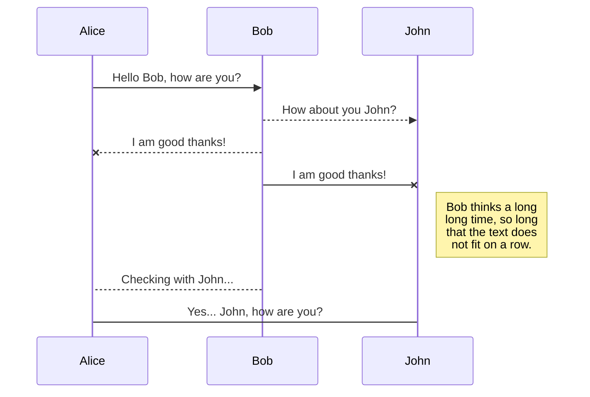
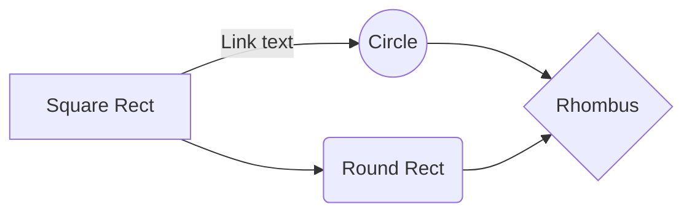

# SVWS Testumgebung
1. [TLDR; Quickstart](#quickstart)
2. [Aufbau des Projekts](#aufbau)
   1. [Docker Runner](#docker-runner)
   2. [Compose & Override, .env](#compose)
   2. [Gradle Plugin](#gradle-plugin)
   3. [Globales Gradle](#gradle-global)
   4. [Testspezifisches Gradle](#gradle-test)
   5. [Buildumgebungen](#buildenv)
   6. [local.properties](#local-properties)
   7. [gitlab-ci.yml](#gitci)
   8. [Vergleich local.properties vs gitlab-ci.yml](#gitci-vs-local)
3. [Änderungen an anderen Gradle-Modulen](#module-changes)
4. [Neue Subprojekte zufügen](#addProject)

## TLDR; Quickstart <a name="quickstart"></a>
### TLDR;
1. [Docker Installation](https://docs.docker.com/desktop/)
2. `docker network create gitlab_runner_network`
3. Kopieren und anpassen von `local.properties` aus `local.properties.example` nach `testing/svws-*/`
4. `./gradlew build`
5. `./gradlew testing:integrationTest`

### Quickstart
Die Testumgebung benötigt eine lokale Dockerinstallation, siehe [Docker Installation](https://docs.docker.com/desktop/).  Installieren und prüfen, ob die Installation geklappt hat:
```
critter@critter-Virtual-Machine:~$ docker --version
Docker version 24.0.4, build 3713ee1
```
Weiterhin benötigen die für die Testumgebung ausgeführten Container ein Dockernetzwerk, um miteinander ohne Umstände über ihre Container-Namen zu kommunizieren:
```
critter@critter-Virtual-Machine:~/git/SVWS-Server$ docker network create gitlab_runner_network
728c2bd6ac200cb8fe8b662862c960406e3bd358a5f57585d5b059dcdbeb2dbb
critter@critter-Virtual-Machine:~/git/SVWS-Server$ docker network ls
NETWORK ID     NAME                    DRIVER    SCOPE
*
*
728c2bd6ac20   gitlab_runner_network   bridge    local
*
*
```
Für die lokale Ausführung sind in den einzelnen Subprojekten lokale Property-Files anzulegen, ein dokumentiertes Beispiel findet sich in `SVWS-Server/testing/local.properties.example`. 

**Wichtig:** Mit diesen Propertyfiles werden die Host-Ports zur Testdurchführung gesteuert, so dass mehrere Testumgebungen parallel gestartet sein können. Freie Ports des Hostsystems nutzen, sowohl für die DB-Container als auch für den SVWS-Container.

#### Ausführen von Tests
Es gibt eine Reihe von Gradle-Tasks, welche für die lokale Ausführung von Bedeutung sind. Vor Ausführung ist derzeit ein lokaler Build zu empfehlen, um Konflikte in der Ausführungsreihenfolge zu vermeiden.

`./gradlew testing:integrationTest` ist der grundlegende Task, um alle Tests der Subprojekte auszuführen. Dabei werden:

1. die Docker-Container mit den nötigen Umgebungsvariablen vorbereitet
2. die Testumgebungen mit DB und Container hochgefahren, 
3. die Tests gegen die definierten Systeme ausgeführt,
4. die Testergebnisse (junit.xml) eingesammelt 
5. und im Anschluss die Testumgebungen runtergefahren
6. sollten die Tests `failure` oder `error`gehabt haben, gibt es folgende Fehlermeldung: 
```"The build finished, but tests resulted with ${totalErrors} errors and ${totalFailures} failures! "``` .

Testergebnisse finden sich in ``SVWS-Server/testing/subproject/build/test-results/``
**Wichtig:** Fehlerhafte/Tests führen nicht zum Abbruch der Gradle-Ausführung, sondern werden am Ende über die junit.xml zusammengefasst.

Darüber hinaus haben die Subprojekte einzelne Tasks, mit denen die Container für diese Subprojekte individuell gesteuert werden können, beispielhaft für ``svws-webclient-integration-test``

`testing:svws-webclient-integration-test:startTestumgebung` führt die notwendigen Schritte zur Erstellung der Container durch und fährt diese hoch.
``docker ps`` zeigt den Status der Container, ``docker logs <id>`` das aktuelle sysout der startup Skripte des jeweiligen Containers.

`testing:svws-webclient-integration-test:apiTest` führt die Tests des Subprojekts gegen die konfigurierte Umgebung durch.

`testing:svws-webclient-integration-test:stopTestumgebung` stoppt die Container.

**TODO** Es kommt vor, dass Docker Compose trotz --force-recreate nicht mit neuen Properties arbeitet, da kann es helfen, mit `docker ps --all` die vorhandenen Images zu sehen und die Images namens `$project.name-db` und `$project.name-svws` mit  `docker container rm <image-name>` zu entfernen.


## Aufbau des Projekts <a name="aufbau"></a>
### Docker Runner <a name="docker-runner"></a>
Dieses Repository enthält die Dateien für einen Docker Runner, der in einem Docker Container auf Basis von Eclipse Temurin 17 läuft. Der Docker Runner ist mit der Docker CLI ausgestattet und kann über eine Socket-Verbindung auf den Docker Daemon des Hosts zugreifen. Dies ermöglicht das Erstellen, Bauen und Stoppen von Docker Containern innerhalb der Testumgebung.

Das Image wird unter https://hub.docker.com/r/svwsnrw/dockerrunner gehostet und wird in der CI Pipeline verwendet.
### Compose & Override, .env <a name="compose"></a>
Die Tests werden mithilfe von Docker Compose ausgeführt, wobei zwei Container gestartet werden: ein Container für die MariaDB-Datenbank und ein Container für die Anwendung "svwstestserver", gegen die die Tests durchgeführt werden. Die Compose Files befinden sich unter **/testing/testumgebung**

#### Verwendete Komponenten
- Docker Compose: Docker Compose wird verwendet, um die Container für die Testumgebung bereitzustellen und zu verwalten.

#### Konfiguration der Container
Die Container werden über ein **.env** File mit den benötigten Daten (Ports, Namen etc.) versorgt. Dieses wird über den Gradle task **createEnv** erzeugt. Da lokal die Ports der Container im von außerhalb erreichbar sein sollen werden diese per override errichtbar gemacht (**docker.override.yml**). 
### Gradle Plugin <a name="gradle-plugin"></a>
Die Tasks für die einzelnen Subprojekte sind in `testing/subproject-plugin.gradle` definiert. Darüber hinaus wird in diesem Skript die Umgebung anhand des vorhandensein der `local.properties` und/oder der Gradle-Umgebungsvariable `-Penvironment` analysiert und die für die Projekte notwendigen Umgebungsvariablen gesetzt.
- wenn `project.hasProperty("environment")` wird dieses genutzt
- sonst wird versucht die `local.propertie` zu lesen
- ansonsten gilt die Umgebung als `undefined`

Tasks:
- `createEnv` erstellt das `.env` für das `docker compose` in `svws-*/build/testumgebung`
- `startTestumgebung` kopiert das `docker-compose.yml` und bei lokaler Umgebung das `docker-compose.override.yml` nach `svws-*/build/testumgebung` und führt ein `docker compose up --force-recreate --wait` aus
- `stopTestumgebung` führt ein `docker compose down` aus


### Globales Gradle <a name="gradle-global"></a>
In `SVWS-Server/testing/build.gradle` sind die auszuführenden Test-Tasks aufgelistet. Außerdem gibt es Tasks:
- `copyArtifacts` zum Kopieren der Build-Artefakte, 
- `buildSVWSApplication` zum Erstellen des Images des App-Containers, 
- `analyzeTestResults` zum Analysieren der Testergebnisse in den junit.xmls
- und `integrationTest` zum Manipulieren und Ausführen der aufgelisteten Tasks

`integrationTest` fügt dabei jedem gelisteten Test-Task die Abhängigkeit auf das Starten der Testumgebung und das `finalizedBy stopTestumgebung` hinzu und setzt das Property `ignoreFailures=true`, damit fehlerhafte Tests das Ausführen weiterer Tests nicht verhindern.

Zu guter letzt definiert dieses build.gradle die Variable `ext.excludeFromTestsDuringBuild=true`, womit die globale Testhook nicht mehr Tasks des Typ `Test` innerhalb der Subprojekte ausführt. Dies wird erreicht, indem im `SVWS-Server/build.gradle` folgendes enthalten ist:
```
	test {
		onlyIf {
			!project.hasProperty('excludeFromTestsDuringBuild')
		}
	    useJUnitPlatform()
	}
   ```


### Testspezifisches Gradle <a name="gradle-test"></a>
Das 
### Buildumgebungen <a name="buildenv"></a>
### local.properties <a name="local-properties"></a>
### gitlab-ci.yml <a name="gitci"></a>
### Vergleich local.properties vs gitlab-ci.yml <a name="gitci-vs-local"></a>
## Änderungen an anderen Gradle-Modulen <a name="module-changes"></a>
## Neue Subprojekte zufügen <a name="addProject"></a>
|                |ASCII                          |HTML                         |
|----------------|-------------------------------|-----------------------------|
|Single backticks|`'Isn't this fun?'`            |'Isn't this fun?'            |
|Quotes          |`"Isn't this fun?"`            |"Isn't this fun?"            |
|Dashes          |`-- is en-dash, --- is em-dash`|-- is en-dash, --- is em-dash|


## UML diagrams

You can render UML diagrams using [Mermaid](https://mermaidjs.github.io/). For example, this will produce a sequence diagram:



And this will produce a flow chart:


